# BlueBike

## How to Build and Run the Code

### Installation

Install all dependencies:

```bash
pip install -r requirements.txt
```

### Download Preprocessed Data

The data processing pipeline takes 15-20 hours to run from scratch. Preprocessed data is available on Hugging Face Hub:

```bash
python download_data.py
```

This downloads the following files (~25MB total):
- `data/processed/daily/daily_departures.parquet` (for Baseline model)
- `data/processed/daily/daily_with_xgb_features.parquet` (for XGBoost models)
- `data/processed/daily/daily_with_poi_features.parquet` (for POI models)
- `data/processed/grid/grid_with_poi_features.parquet` (for grid prediction)

**Optional**: To run trip-level EDA visualizations, uncomment the `trips_cleaned.parquet` line in `download_data.py` (adds 1GB download).

**Note**: If you prefer to generate data from scratch, see the "Data Preparation from Scratch" section below.

### Running Models

After downloading the data, run the models in order:

```bash
# Baseline Model - predicts 2024 demand using historical patterns from 2015-2023
python src/models/baseline.py
# Output: results/models/baseline_metrics.csv, baseline_predictions_2024.csv

# XGBoost Model - uses temporal, weather, and location features (lat/lon, nearby popularity)
python src/models/xgboost_model.py
# Output: results/xgboost/xgboost_metrics.csv, feature_importance.csv, xgboost_model.pkl

# XGBoost without location/history - removes coordinates and historical popularity features
python src/models/xgboost_no_popularity.py
# Output: results/xgboost_no_popularity/xgboost_metrics_no_popularity.csv, feature_importance_no_popularity.csv, xgboost_model_no_popularity.pkl

# XGBoost with POI features - replaces location with Points of Interest data
python src/models/xgboost_poi_only.py
# Output: results/xgboost_poi_only/xgboost_metrics_poi_only.csv, feature_importance_poi_only.csv, xgboost_model_poi_only.pkl

# Grid-based demand prediction - requires trained xgboost_poi_only model (run above command first)
# Uses the trained model to predict demand for new locations across Boston metro area
python src/analysis/predict_grid_demand.py
# Output: results/grid_analysis/grid_predictions.parquet, expansion_opportunities.csv, grid_demand_comparison.csv
```

### Generating Visualizations

```bash
# Model comparison charts - compare baseline vs XGBoost models
python src/visualization/model_comparison.py
# Output: results/comparison/model_comparison.png

python src/visualization/three_model_comparison.py
# Output: results/comparison/three_model_comparison.png

# Feature importance visualizations
python src/visualization/feature_importance_poi_only.py
# Output: results/xgboost_poi_only/feature_importance_poi_only.png

python src/visualization/feature_importance_no_location.py
# Output: results/xgboost_no_popularity/feature_importance_no_popularity.png

# Interactive maps - open the HTML files in a browser to view
python src/visualization/poi_station_map.py
# Output: results/poi_analysis/station_type_map.html, station_classifications.csv

python src/visualization/grid_poi_map.py
# Output: results/grid_analysis/grid_poi_map.html (POI distribution across grid)

python src/visualization/grid_demand_map.py
# Output: results/grid_analysis/grid_demand_map.html (predicted demand vs actual stations)

# Exploratory data analysis charts
python src/visualization/daily_analysis.py
# Output: results/figures/daily/daily_patterns.png

python src/visualization/station_analysis.py
# Output: results/figures/station/station_activity.png

# Optional: Trip-level EDA (requires trips_cleaned.parquet - see download_data.py)
# python src/visualization/eda_overview.py
# Output: results/figures/overview/yearly_departure_trend.png, results/statistics/yearly_statistics.csv
```

### Data Preparation from Scratch (Optional)

If you want to reproduce the entire data processing pipeline from raw data, run these commands in order. Note that this process is time-consuming and requires substantial disk space.

```bash
# Download raw Bluebikes trip data from 2015-2024 (takes 30+ minutes, ~5GB disk space)
python src/data_collection/bluebikes_download.py
# Output: data/raw/*.csv

# Clean and standardize the raw trip data (takes 10-20 minutes)
python src/preprocessing/data_cleaning.py
# Output: data/processed/bluebike_cleaned/trips_cleaned.parquet

# Add temporal features (month, day of week, season, holidays, etc)
python src/preprocessing/feature_engineering.py
# Output: data/processed/daily/daily_departures.parquet, daily_departures_sample.csv
#         data/processed/hourly/hourly_departures.parquet, hourly_departures_sample.csv

# Aggregate trips by station and date
python src/preprocessing/prepare_station_daily.py
# Output: data/processed/daily/station_daily_with_coords.parquet, station_daily_with_coords_sample.csv

# Fetch weather data for each station (takes 6-8 hours due to API rate limits)
python src/data_collection/weather_api.py
# Output: data/external/weather/station_daily_with_weather.parquet, station_daily_with_weather_sample.csv

# Add location-based features (nearby area popularity)
python src/preprocessing/add_xgb_features.py
# Output: data/processed/daily/daily_with_xgb_features.parquet, daily_with_xgb_features_sample.csv

# Extract POI features from OpenStreetMap (takes 1-4 hours)
python src/preprocessing/add_poi_features.py
# Output: data/processed/daily/daily_with_poi_features.parquet, daily_with_poi_features_sample.csv

# Create grid features for spatial prediction (takes 2-7 hours for POI extraction)
python src/analysis/create_grid_features.py
python src/analysis/add_grid_poi.py
# Output: data/processed/grid/grid_with_poi_features.parquet, grid_with_poi_features_sample.csv
#         data/processed/grid/grid_base_features.parquet, grid_base_features_sample.csv
```

---

## Interactive Visualizations

This project includes interactive HTML maps that can be directly opened in a browser:
- **`results/poi_analysis/station_type_map.html`** - Station classification by surrounding POI types
- **`results/grid_analysis/grid_poi_map.html`** - POI distribution across 500m×500m grid cells in Boston metro area
- **`results/grid_analysis/grid_demand_map.html`** - Predicted demand heatmap compared with actual station distribution

All other visualizations (model comparison charts, feature importance plots, EDA figures) are static PNG images referenced throughout this README.

---

## Project Structure

### Directory Organization

- **`src/`** - Source code organized by functionality
  - `data_collection/` - Scripts for downloading raw trip data and fetching weather information
  - `preprocessing/` - Data cleaning and feature engineering pipelines
  - `models/` - Machine learning model implementations (Baseline, XGBoost variants)
  - `analysis/` - Advanced analysis scripts (grid-based spatial prediction)
  - `visualization/` - Visualization generation scripts for charts and interactive maps
- **`data/`** - Data storage (excluded from repository due to size)
  - `raw/` - Original trip data CSV files
  - `processed/` - Cleaned and feature-enriched datasets
  - `external/` - Weather data and POI caches
- **`results/`** - Model outputs, metrics, and visualizations
  - `models/` - Baseline model results
  - `xgboost*/` - Various XGBoost model outputs
  - `comparison/` - Model comparison charts
  - `figures/` - Exploratory data analysis visualizations
  - `poi_analysis/` - POI-related visualizations
  - `grid_analysis/` - Spatial prediction results and maps

### Development Phases

#### Phase 1: Initial Exploration and Baseline Model

In the initial phase, I focused on understanding the Bluebikes ridership patterns. I collected historical trip data from 2015-2024, cleaned and standardized the dataset, and engineered temporal features (month, day of week, season, holidays). I also integrated weather data from Open-Meteo API to capture external conditions affecting ridership. For the XGBoost model, I added location-based features including coordinates (latitude/longitude) and a `nearby_avg_popularity` metric representing the historical activity level of surrounding stations. I created various visualizations to explore the data and built two prediction models: a simple baseline and an XGBoost model. Detailed analysis of this phase is documented in the **Mid-term Progress** section below.

**Key Scripts (Phase 1):**
- `src/data_collection/bluebikes_download.py` - Downloads raw trip data from Bluebikes official website
- `src/preprocessing/data_cleaning.py` - Cleans and standardizes raw trip records
- `src/preprocessing/feature_engineering.py` - Adds temporal features (month, day, season, holidays)
- `src/preprocessing/prepare_station_daily.py` - Aggregates trips by station and date
- `src/data_collection/weather_api.py` - Fetches historical weather data for each station
- `src/preprocessing/add_xgb_features.py` - Adds location-based features including `nearby_avg_popularity`
- `src/models/baseline.py` - Implements a simple historical-pattern-based baseline model
- `src/models/xgboost_model.py` - Trains XGBoost model with all features (location, weather, temporal)

#### Phase 2: Generalization for New Station Prediction

The Phase 1 model, while accurate for existing stations, relies on location-specific features (coordinates and historical popularity) that would not be available for potential new station locations. To build a model capable of predicting demand at arbitrary locations across Boston, I removed these "leakage" features and instead extracted Points of Interest (POI) data from OpenStreetMap. POI features (subway stations, bus stops, restaurants, shops, offices, universities, schools, hospitals, banks, parks) provide generalizable contextual information about an area without requiring historical ridership data. I retrained XGBoost models with different feature combinations to evaluate the impact of removing location features and adding POI features. I also implemented a grid-based spatial prediction system that divides Boston metro area into 500m×500m cells and predicts demand for each cell. Detailed analysis is in the **Phase 2 Results** section.

**Key Scripts (Phase 2):**
- `src/preprocessing/add_poi_features.py` - Extracts POI features from OpenStreetMap for each station
- `src/models/xgboost_no_popularity.py` - XGBoost without coordinates and historical popularity
- `src/models/xgboost_poi_only.py` - XGBoost using POI features instead of location-specific features
- `src/analysis/create_grid_features.py` - Creates 500m×500m grid covering Boston metro area with temporal and weather features
- `src/analysis/add_grid_poi.py` - Extracts POI features for each grid cell
- `src/analysis/predict_grid_demand.py` - Predicts demand for grid cells using the POI-based model

**Visualization Scripts:**

All visualization scripts are in `src/visualization/`:
- `eda_overview.py` - System-level yearly statistics and growth trends
- `daily_analysis.py` - Daily and weekly ridership patterns
- `station_analysis.py` - Station-level activity distribution
- `model_comparison.py` - Compares Baseline vs XGBoost performance
- `three_model_comparison.py` - Compares Baseline, No Location, and POI Only models
- `feature_importance_poi_only.py` - Visualizes POI feature importance
- `feature_importance_no_location.py` - Visualizes feature importance without location features
- `poi_station_map.py` - Interactive map showing station classifications by surrounding POI types
- `grid_poi_map.py` - Interactive map displaying POI distribution across grid cells
- `grid_demand_map.py` - Interactive map showing predicted demand vs actual station distribution

---

## Proposal

### 1. Project Description & Motivation

The Bluebikes program, Boston's official bike-share system, makes its complete ridership data publicly available. This rich dataset provides details for every trip, including:

- Trip Duration (in seconds)
- Start and Stop Times
- Start and End Station Names & IDs
- Bike ID
- User Type (Casual vs. Member)

This data allows for a deep exploration of user ridership patterns and behaviors. The primary objective of this project is to leverage this dataset to uncover actionable insights into how, when, and where the service is used. Understanding these habits is the first step toward building predictive models that can help optimize the system's operational efficiency.


### 2. Project Objectives

The ultimate goal of this project is to provide data-driven recommendations that could help Bluebikes optimize its operational efficiency and improve bike availability for its users. To achieve this, I have defined the following core objectives:

- **Develop a Predictive Demand Model**: My primary technical objective is to build and validate a machine learning model that forecasts hourly bike demand. The model will predict the number of bike departures from any given station based on a range of features, including:
  - Station characteristics (e.g., location)
  - Temporal factors (time of day, day of week, holidays)
  - External conditions (historical weather data)

- **Generate a City-Wide Demand Heatmap for Strategic Network Planning**: Beyond forecasting for existing stations, the second aim is to formulate a spatial prediction model to estimate potential bike demand across the Boston/Cambridge area as a whole. This would be then used to locate strategically appropriate sites for the expansion and/or consolidation of the network.
  - **Prediction Target**: The potential number of bike departures within a given hour from a particular geographical grid cell—for instance, a 100m x 100m cell.
  - **Feature Engineering**: For the purpose of predicting demand at locations without previously existing stations, a rich geospatial feature set will be constructed at the level of the grid cell, which might include(not fixed):
    - The proximity to public transit interchange points, e.g., subway and bus stops
    - Density of points of interest, e.g., restaurants, offices, and parks
    - Local demographic features, e.g., population density
    - Local bike network characteristic features, e.g., the presence of protected bike lanes
  - **Expected Outcome**: The model output will be a complete city demand heatmap, highlighting untapped "hotspots" (potentially ideal locations for new stations) and demand "coldspots" (where existing stations may be underutilized and could be considered for relocation or removal).

- **Propose Novel Operational Strategies** (if time permitted): As a secondary objective, I will explore how the model could inform new strategies, such as implementing dynamic pricing during off-peak hours or offering user incentives to help redistribute bikes from over-supplied to under-supplied stations.

### 3. Data Collection Strategy

This project will utilize three primary data sources: Bluebikes' official ridership data, historical weather data, and various geospatial datasets describing the Boston area.

### Bluebikes Ridership Data

- **Source**: The complete dataset of historical trip data will be sourced directly from the official Bluebikes website: https://bluebikes.com/system-data
- **Methodology**: I will download the monthly trip data files (in CSV format). This will form the core of my dataset for training and testing my predictive models

### Historical Weather Data

- **Source**: Hourly historical weather data will be obtained via the Open-Meteo Historical Weather API, a reliable and publicly accessible source: https://open-meteo.com/en/docs/historical-weather-api
- **Methodology**: I will implement a Python script to programmatically collect the weather data. The process will be as follows:
  - Extract the latitude and longitude coordinates for every Bluebikes station from the ridership data
  - For my specified date range, the script will make API calls to request the corresponding hourly weather variables (including temperature, precipitation, and wind speed) for each station's location
  - The API responses will be parsed, cleaned, and structured into a tabular format ready to be merged with the Bluebikes trip data

### Geospatial & Demographic Data for Spatial Modeling

#### Public Transit Network

- **Source**: Official GTFS data for the MBTA network. The most up-to-date files are now version-controlled and can be found on the MBTA's official GitHub-style archive: https://cdn.mbta.com/archive/archived_feeds.txt
- **Methodology**: I will parse these files to extract the precise latitude and longitude of all subway and bus stops, which are critical drivers of bike trips.

#### Urban Infrastructure & Points-of-Interest (POIs)

- **Source**: This kind of data can be accessed via the OSMnx library: https://osmnx.readthedocs.io/en/stable/
- **Methodology**: I will use the Python library OSMnx to programmatically get data on the locations of key POIs (e.g., restaurants, offices, universities, parks).

#### Demographic Data

- **Source**: The U.S. Census Bureau's public data portal: https://data.census.gov/
- **Methodology**: I will acquire population density and potentially other demographic data at the census tract level. This will allow me to correlate potential bike demand with the characteristics of the people living and working in each area.


### 4. Modeling Approach

Since precise prediction of bike departures is challenging, my approach is to conduct a comparative study. I will implement several types of models to establish performance benchmarks and identify the most suitable method for this problem.

- **Baseline Model**: I will first establish a simple, non-machine learning baseline. This model will use straightforward rules to make predictions, serving as a critical benchmark to measure the effectiveness of my more advanced models

- **Tree-Based Models**: The ridership data is highly structured, making tree-based models an excellent candidate. I will explore ensemble methods like Gradient Boosting (e.g., XGBoost), which are known to perform very well on this type of tabular data.

  To effectively use these models, I will reframe the problem from a time-series task to a standard regression/classification task. This involves extensive feature engineering to explicitly extract key information—such as the hour of day, holiday status, station location, and weather conditions—from the raw data.

- **Deep Learning Models**: To explore alternative patterns in the data, especially potential time-series dependencies, I will also implement a deep learning model. This will provide a valuable point of comparison against the performance of the tree-based models

- **Exploratory LLM Integration** (If time permitted): As an extension, I will explore the capabilities of a Large Language Model (LLM). I plan to test its utility in two ways: first, as a tool for advanced feature engineering by interpreting the context of a situation, and second, by evaluating its ability to make direct predictions through prompting

### 5. Data Visualization Plan

My visualization strategy will focus on two key areas: exploratory data analysis to understand the data's underlying patterns and results visualization to interpret my model's performance. I will primarily use Python libraries such as Matplotlib, Seaborn, and Folium.

- **Geospatial Visualization**: I will create interactive maps of the Boston area to visualize station locations and ridership flow. A key visualization will be a heatmap of trip start and end points to quickly identify the most popular hubs and travel corridors in the city

- **Temporal Pattern Visualization**: To understand how demand changes over time, I will create:
  - Time-series plots showing daily and weekly trip counts to identify long-term trends and seasonality
  - Bar charts aggregating trips by the hour of the day and day of the week to reveal daily commute patterns and weekend activity

- **Correlation Visualization**: I will use scatter plots to investigate the relationship between weather conditions (like temperature and precipitation) and the number of bike trips, helping me validate key features for my model

- **Model Performance Visualization**: To evaluate my final model, I will plot the predicted demand values against the actual values over time. This will allow me to visually inspect where my model performs well and where it struggles

### 6. Test Plan

Because I am working with time-series data, I will not use a random split. I will perform a temporal split, using historical data for training and a more recent, unseen period for testing. For example, I might train my model on data from 2023-2024 and test its performance on data from 2025.

---

## Mid-term Progress

**Project Presentation**: https://youtu.be/K75Yq7wpM4Y

### Data Visualization

I created several visualizations to understand the Bluebikes data better. Here's what I found:

#### System Growth Over Time
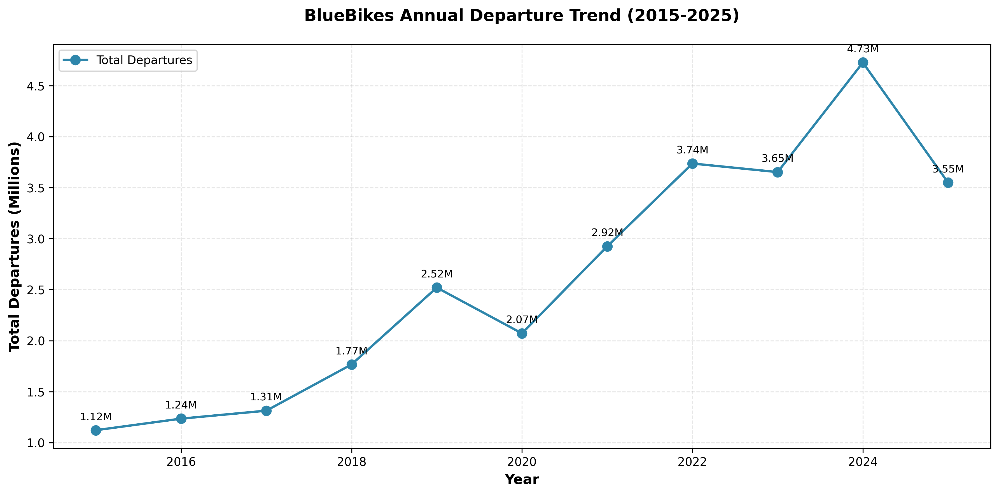

The system grew from about 1.1 million trips in 2015 to 4.7 million trips in 2024, with the number of stations increasing from around 100 to over 400. I excluded 2020 data from model training due to COVID-19 impacts.

#### Daily Patterns
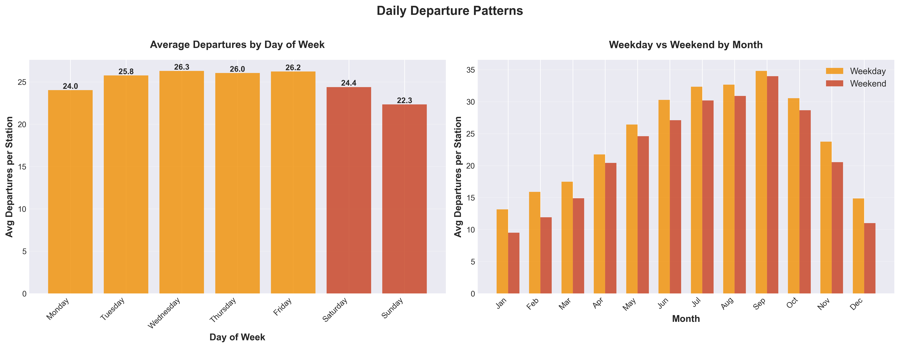

I noticed clear patterns in when people use the bikes:
- **Weekdays vs Weekends**: People use bikes differently on weekdays compared to weekends. Weekdays show typical commute patterns.
- **Monthly Changes**: Summer months (June-August) are way busier than winter months.

#### Station Activity
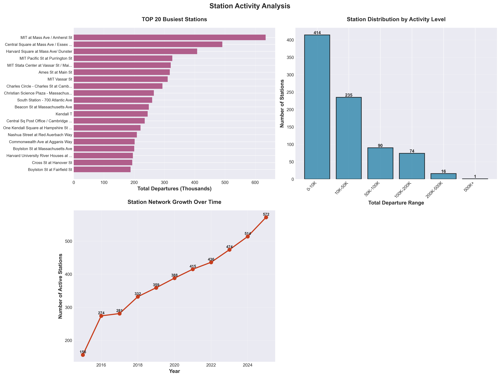

Not all stations are equal. I found:
- The top 20 stations handle a huge portion of all trips
- Most stations are "medium activity" - they're not super busy but they're not empty either
- The network keeps growing - new stations get added almost every year

### Data Processing

Here's what I did:

#### Data Collection
I downloaded all the monthly trip files from the Bluebikes website (2015-2024). That's about 28.6 million trips total. Each trip record tells us when and where someone picked up a bike and where they dropped it off.

#### Data Cleaning
The raw data had some issues:
- **Different column names**: Older files used different names than newer ones. For example, "subscriber" vs "member". I standardized everything.
- **Missing data**: Some early files didn't have trip duration, so I calculated it from start time and end time.
- **Station ID problems**: Station IDs changed from numbers to letters+numbers over the years. I decided to use station names instead since those are more consistent.
- **Outliers**: Some trips have unrealistic durations (under 10 seconds or over several days), but I kept all records in the dataset.

#### Feature Engineering
I added a bunch of useful information to each trip:
- **Time features**: What month? What day of week? Is it a weekend? What season?
- **Holiday flag**: Is this date a US federal holiday?
- **Location features**: For each station, I calculated how busy the surrounding area is based on historical data

#### Weather Data
I used the Open-Meteo API to get daily weather for each station. The challenge was:
- I needed weather for 800+ stations
- I needed 10 years of data (2015-2024)
- The API has rate limits (about 10 requests per minute)

So I built a system that caches the data as it downloads, which means if it gets interrupted, I can pick up where I left off instead of starting over. It took about 7 hours to get all the weather data.

The weather data includes: temperature (max/min/mean), precipitation, rain, snow, and wind speed.

#### Data Aggregation
Since I'm predicting daily demand, I grouped all the trips by station and date. The final dataset has:
- **1.14 million records** (one for each station-date combination)
- **18 features** total
- **Target variable**: number of departures per station per day

### Modeling Methods

I built two models to compare:

#### Baseline Model
This is a simple model that assumes patterns repeat. Here's how it works:
1. Look at all the historical data (2015-2023, skipping 2020)
2. For each station, calculate what percentage of total trips it usually gets on day X of the year
3. Estimate what 2024's total trips will be using average growth rate from previous years
4. Multiply: station's historical percentage × estimated 2024 total = prediction

This model is simple but gives us something to beat.

#### XGBoost Model
I use XGBoost as my first machine learning model for prediction. It uses gradient boosting, which is basically a bunch of decision trees working together.

**Features I used**:
- Time: month, day, day of week, season, weekend flag, holiday flag
- Location: latitude, longitude, plus how busy the surrounding area usually is
- Weather: 9 weather variables (temperature, precipitation, wind)

**Feature selection note**:
When I included "year" as a feature, the model predicted total 2024 volume far higher than the actual value. This is probably because the model learned a simple linear trend rather than understanding the actual patterns. So I removed the "year" feature and also excluded "previous month's total trips" to avoid mixing seasonal patterns with growth trends. I also used strong regularization (L1 and L2) to prevent overfitting.

**Training setup**:
- Training data: 2015-2023 (excluding 2020) = about 680K records
- Test data: 2024 = about 205K records
- I used 500 trees with a max depth of 5

### Preliminary Results

#### Feature Importance

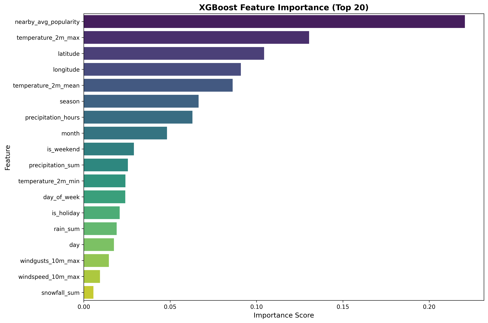

The most important features for prediction are:
1. **Nearby area activity** (22.1%) - Historical activity level of surrounding stations
2. **Temperature max** (13.0%) - Daily maximum temperature
3. **Latitude** (10.4%) - Station location (north-south)
4. **Longitude** (9.1%) - Station location (east-west)
5. **Temperature mean** (8.6%) - Daily average temperature
6. **Season** (6.6%) - Time of year
7. **Precipitation hours** (6.3%) - Duration of rain/snow

Location and weather are the primary drivers of bike demand, with the surrounding area's historical popularity being the single most important factor.

#### Model Comparison

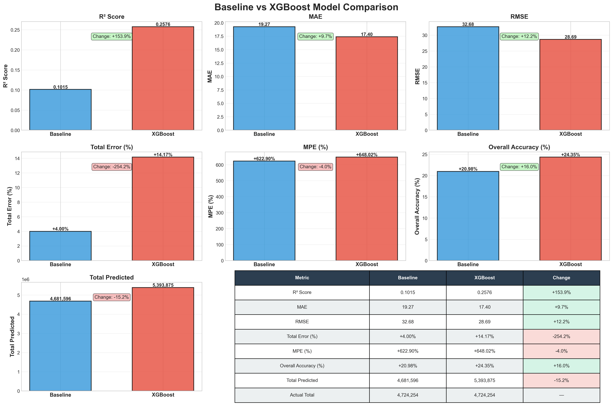

| Metric | Baseline | XGBoost | Improvement |
|--------|----------|---------|-------------|
| R² Score | 0.101 | 0.258 | +154% |
| MAE | 19.27 | 17.40 | -9.7% |
| RMSE | 32.68 | 28.69 | -12.2% |
| Total Error | +4.00% | +14.17% | Worse |

The XGBoost model shows significant improvements over the baseline: R² Score increased by 154% (from 0.101 to 0.258), MAE decreased by 9.7% (from 19.27 to 17.40 bikes/day), and RMSE decreased by 12.2% (from 32.68 to 28.69). However, the model overestimates total 2024 volume by 14%, compared to the baseline's 4% overestimation. This overestimation led to an important discovery about the practical value of this model.

#### Overestimation Analysis: Identifying Capacity Constraints

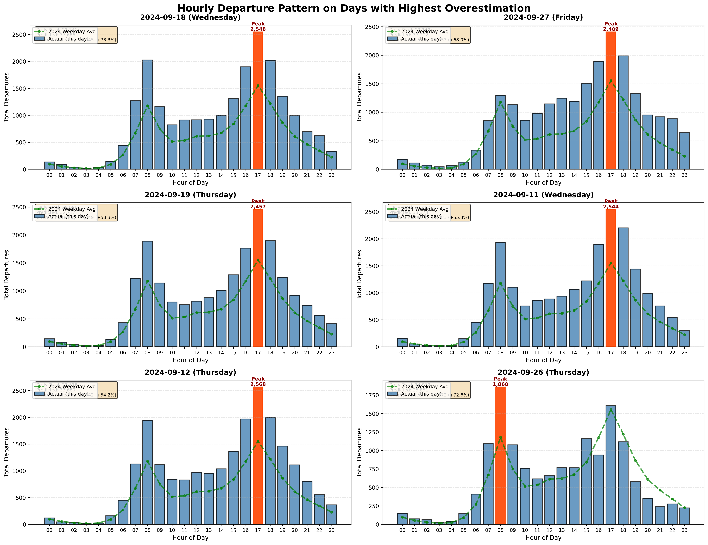

I conducted a detailed analysis of days where the model's predictions significantly exceeded actual ridership. The key finding was that **these high-prediction days also had actual ridership far above the station's average**. This suggests that the model correctly identified high-demand periods, but the actual usage was constrained by station capacity (limited number of bikes or docks).

**Key Insights:**

1. **Capacity Bottlenecks**: When the model predicts much higher demand than observed, it often indicates the station is operating at or near full capacity. The "missing" trips aren't prediction errors—they're lost revenue opportunities due to insufficient bikes or docks.

2. **Expansion Opportunities**: Stations with consistent overestimation are prime candidates for capacity expansion. Adding more bikes or docks at these locations would likely increase actual ridership and generate additional revenue.

3. **Practical Value of Phase 1 Model**: While the location-based features (coordinates, `nearby_avg_popularity`) make this model unsuitable for predicting demand at entirely new locations, they are **highly valuable for capacity planning at existing stations**. The model excels at identifying which stations need more resources based on historical usage patterns and local context.

This analysis demonstrates that prediction "errors" can reveal actionable business insights. The Phase 1 model serves a different but equally important purpose: optimizing the existing network by identifying underutilized capacity versus capacity constraints.

### Summary

I have completed data collection, cleaning, and visualization for the Bluebikes dataset. I built and compared two prediction models: a simple baseline model and an XGBoost machine learning model. The XGBoost model shows clear improvements with R² increasing from 0.101 to 0.258, demonstrating that machine learning can capture patterns that simple historical methods miss. Analysis of the model's overestimation patterns revealed that high predictions often coincide with days when actual usage is already far above average, indicating **capacity constraints** rather than prediction errors. This finding demonstrates the practical value of this model: while its location-based features make it unsuitable for new station placement, it is **highly effective for identifying existing stations that need capacity expansion**.

**Code Organization**: All code is available in the GitHub repo:
- `src/data_collection/` - Data download scripts
- `src/preprocessing/` - Data cleaning and feature engineering
- `src/models/` - Baseline and XGBoost models
- `src/visualization/` - Visualization scripts
- `results/` - Figures and metrics
- `data/` - Raw and processed data (not uploaded due to size, excluded via .gitignore)

---

## Phase 2 Results

### Motivation: Building a Generalizable Demand Prediction Model

The Phase 1 model, while effective for capacity planning at existing stations, has a critical limitation: it relies on location-specific features (`latitude`, `longitude`, `nearby_avg_popularity`) that create **data leakage** when attempting to predict demand at new, unseen locations. These features essentially encode historical ridership patterns tied to specific coordinates, making the model unsuitable for answering the strategic question: "Where should we place new stations?"

To build a model capable of predicting bike demand at arbitrary locations across the Boston metro area, I needed to replace these location-specific features with **generalizable contextual information** that describes what makes an area attractive for bike-sharing, without requiring historical data.

### Feature Engineering: Points of Interest (POI) Extraction

I extracted POI features from OpenStreetMap using the OSMnx library to capture the urban context around each location. The extraction methodology:

**Search Methodology:**
- **Radius**: 500 meters (approximately 5-6 minute walk)
- **Data Source**: OpenStreetMap via OSMnx library
- **Caching**: Results cached locally to avoid redundant API calls

**POI Categories Extracted:**

The model captures 10 types of urban features within the 500m radius:

| POI Type | Feature Name | Measurement | Description |
|----------|--------------|-------------|-------------|
| Subway Stations | `nearby_subway_stations_count` | Count | MBTA subway/metro stations |
| Bus Stops | `nearby_bus_stops_count` | Count | Public bus stops |
| Restaurants | `nearby_restaurants_count` | Count | Restaurants, cafes, fast food |
| Shops | `nearby_shops_count` | Count | Retail stores |
| Offices | `nearby_offices_count` | Count | Office buildings |
| Universities | `nearby_universities_count` | Count | Higher education institutions |
| Schools | `nearby_schools_count` | Count | K-12 schools |
| Hospitals | `nearby_hospitals_count` | Count | Medical facilities |
| Banks | `nearby_banks_count` | Count | Banking institutions |
| Parks | `nearby_parks_area_sqm` | Area (m²) | Green space area |

### Addressing Data Leakage: Removed Features

To ensure the model can generalize to new locations, I **excluded the following features** that were present in the Phase 1 model:

| Removed Feature | Reason for Exclusion |
|-----------------|---------------------|
| `latitude` | Data leakage; No meaning for new stations |
| `longitude` | Data leakage; No meaning for new stations |
| `nearby_avg_popularity` | Historical ridership metric; requires existing station data |

**Why Coordinates Create Data Leakage:**

At first glance, latitude and longitude might seem like legitimate geographic features—they're just numbers representing a location's position. However, in the context of predicting demand at existing stations, these coordinates act as **surrogate identifiers** for historical ridership patterns rather than meaningful geographic information.

Here's why: coordinates as numbers (e.g., `42.3601, -71.0589`) have no intrinsic meaning to the model. The model doesn't understand "this latitude means downtown" or "this longitude means waterfront." Instead, through training on years of data, the model simply **memorizes** that certain coordinate pairs consistently correlate with high or low ridership. Essentially, the model learns: "coordinate (42.36, -71.06) = hot station, coordinate (42.30, -70.95) = cold station."

This memorization is fine for predicting demand at existing stations—it's actually valuable for capacity planning. But for a new station at coordinates the model has never seen, these numbers are meaningless. The model can't extrapolate from nearby coordinates because it never learned the *reason* why certain areas have high demand; it only learned to recognize specific coordinate patterns.

The `nearby_avg_popularity` feature has the same issue: it directly encodes "how popular is this area historically," which is unavailable for locations without existing stations.

**The POI Solution:**

POI features solve this by describing *what makes an area attractive* (transit access, commercial activity, offices, etc.) rather than *which specific location it is*. A new location near a subway station and surrounded by restaurants will have similar POI features to existing high-demand stations in similar contexts, allowing the model to generalize.

**Final Feature Set for POI-Based Model:**

- **Temporal Features (6)**: month, day, day_of_week, season, is_weekend, is_holiday
- **POI Features (10)**: All POI counts/areas listed above
- **Weather Features (9)**: temperature (max/min/mean), precipitation, rain, snow, precipitation hours, wind speed, wind gusts

**Total: 25 features**, all of which can be obtained for any arbitrary location in the Boston area.

### Model Training and Experimental Setup

**Training/Test Split:**
- **Training Set**: 2015-2023 (excluding 2020 due to COVID-19), approximately 680,000 records
- **Test Set**: 2024, approximately 205,000 records
- **Split Strategy**: Temporal split to simulate real-world deployment where we predict future demand

**Model Architecture:**

I used XGBoost (Gradient Boosting) with identical hyperparameters across all experiments to ensure fair comparison:

| Hyperparameter | Value | Purpose |
|----------------|-------|---------|
| `max_depth` | 5 | Control tree depth to prevent overfitting |
| `learning_rate` | 0.05 | Conservative learning for stable convergence |
| `n_estimators` | 500 | Number of boosting rounds |
| `subsample` | 0.8 | Use 80% of data per tree (stochastic boosting) |
| `colsample_bytree` | 0.8 | Use 80% of features per tree |
| `min_child_weight` | 5 | Minimum samples required in leaf nodes |
| `gamma` | 0.2 | Minimum loss reduction for splits |
| `reg_alpha` | 1.0 | L1 regularization |
| `reg_lambda` | 5.0 | L2 regularization |

The strong regularization (L1 and L2) helps prevent the model from overfitting to specific stations or dates.

### Experimental Results: The Critical Role of POI Features

To validate the value of POI features, I conducted an ablation study comparing two models:

1. **XGBoost No Location** - Only temporal and weather features (15 features total)
2. **XGBoost POI Only** - Temporal, weather, and POI features (25 features total)

#### Model Comparison: No POI vs. With POI

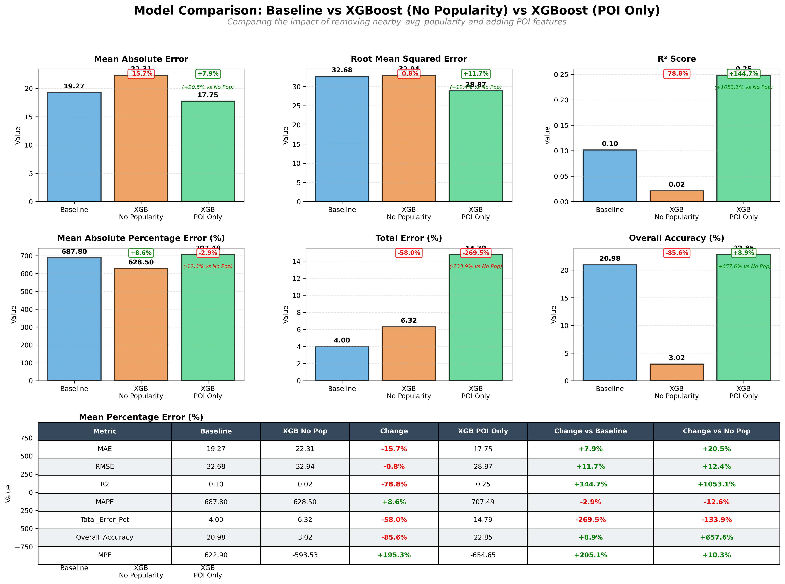

| Metric | No Location | POI Only | Improvement |
|--------|-------------|----------|-------------|
| **R² Score** | 0.022 | 0.248 | **+1027%** |
| **MAE** | 22.31 | 17.75 | **-20.4%** |
| **RMSE** | 32.94 | 28.87 | **-12.4%** |
| **Overall Accuracy** | 3.02% | 22.85% | **+657%** |
| **Total Error** | +6.32% | +14.79% | Worse |

**Key Findings:**

#### 1. Without POI Features: Poor Performance

The model with only temporal and weather features achieved an R² of 0.022, explaining only 2% of the variance in bike demand. This is essentially no better than predicting the average ridership for all stations. The overall accuracy of 3.02% indicates the model has minimal predictive power.

The reason is straightforward: without location information, the model cannot distinguish between a busy downtown station near a subway stop and a quiet residential station. Time and weather patterns are shared across all stations—everyone experiences the same weather on the same day—so these features alone cannot explain why some stations are consistently busier than others. The model lacks spatial context and treats all stations as identical.

#### 2. With POI Features: Substantial Improvement

Adding POI features substantially improved the model's performance:
- R² increased 10-fold (from 0.022 to 0.248), indicating the model now captures meaningful demand patterns
- MAE decreased by 20.4% (from 22.31 to 17.75 bikes/day), showing more accurate predictions
- Overall Accuracy increased 7.6-fold (from 3.02% to 22.85%), demonstrating substantial predictive power

POI features provide the spatial context that time and weather cannot. They answer the fundamental question: what makes a location attractive for bike-sharing? A location near multiple restaurants, offices, and a subway station will naturally have higher demand than a location with few amenities. The model learns these patterns and can generalize to new locations with similar POI profiles.

#### 3. Trade-off: Higher Total Volume Error

The POI model's total volume error increased to 14.79% (compared to 6.32% for the No Location model), indicating the model is somewhat optimistic in its predictions. However, this trade-off is acceptable. The No Location model achieves low error by predicting similar demand everywhere, failing to capture the variation between stations. The POI model attempts to predict high demand where appropriate, leading to some overestimation but much better discrimination between high and low-demand locations. As I found in Phase 1, overestimation can indicate capacity constraints rather than prediction errors.

### Feature Importance Analysis

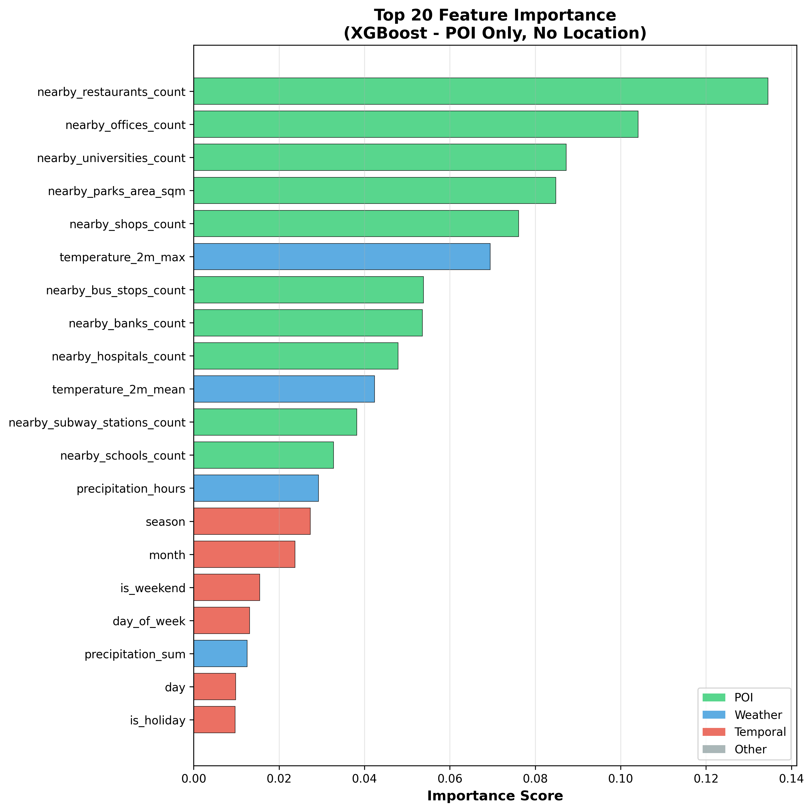

**Top 10 Most Important Features (POI Only Model):**

| Rank | Feature | Importance | Category | Interpretation |
|------|---------|------------|----------|----------------|
| 1 | `nearby_restaurants_count` | 13.45% | POI | Commercial/dining activity is the strongest demand driver |
| 2 | `nearby_offices_count` | 10.41% | POI | Workplace density drives commuter demand |
| 3 | `nearby_universities_count` | 8.72% | POI | Educational institutions generate consistent ridership |
| 4 | `nearby_parks_area_sqm` | 8.49% | POI | Recreational destinations attract riders |
| 5 | `nearby_shops_count` | 7.61% | POI | Retail activity indicates high foot traffic areas |
| 6 | `temperature_2m_max` | 6.95% | Weather | Warmer weather encourages cycling |
| 7 | `nearby_bus_stops_count` | 5.38% | POI | Public transit integration drives first/last mile trips |
| 8 | `nearby_banks_count` | 5.36% | POI | Financial district indicator |
| 9 | `nearby_hospitals_count` | 4.79% | POI | Medical facilities generate trips |
| 10 | `temperature_2m_mean` | 4.24% | Weather | Overall temperature conditions matter |

8 of the top 10 features are POI-related, collectively accounting for 64.2% of the model's decision-making. Temperature features rank 6th and 10th, showing weather also matters but is secondary to location context. This validates the hypothesis that urban context is more important than temporal patterns for predicting station-level demand.

**Key Insights:**

1. **Commercial Activity Matters Most**: Restaurants (13.45%) and offices (10.41%) are the top predictors, indicating that bike-share demand is driven primarily by access to work and dining/entertainment destinations.

2. **Transit Integration is Important**: Bus stops (5.38%) and subway stations (3.82%) show that bike-sharing serves as a first/last mile solution for public transit users.

3. **Universities are High-Value Locations**: At 8.72% importance, proximity to universities is the 3rd most important feature, reflecting student and staff reliance on bike-sharing.

4. **Weather Remains Secondary**: Temperature features (6.95% + 4.24%) are important but secondary to location context. While weather cannot be controlled, station locations can be strategically chosen.

**Comparison with No Location Model:**

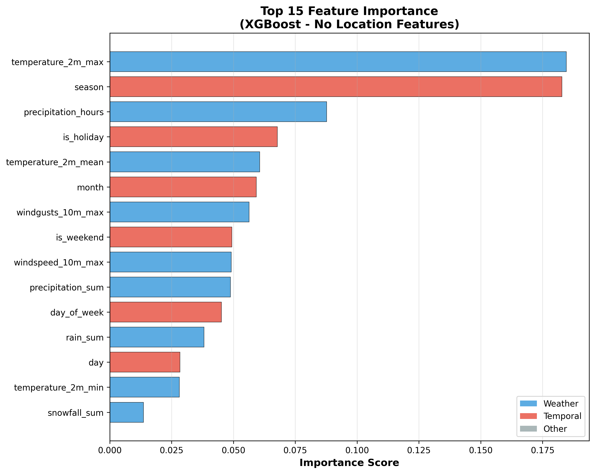

In the No Location model, the top features were:
1. Temperature (18.46%)
2. Season (18.28%)
3. Precipitation hours (8.77%)

Without spatial context, the model relies entirely on temporal and weather patterns, but these alone cannot differentiate stations, leading to the poor performance observed.

### Validation: POI-Based Model is Generalizable

The critical difference between Phase 1 and Phase 2 models:

| Aspect | Phase 1 (Location-Based) | Phase 2 (POI-Based) |
|--------|--------------------------|---------------------|
| Key Features | latitude, longitude, nearby_avg_popularity | POI counts, transit access, amenities |
| What Model Learns | Which coordinate pairs = high demand | Which contexts = high demand |
| Generalizability | Cannot predict for new coordinates | Can predict for any location |
| Use Case | Capacity planning at existing stations | New station site selection |
| Performance | R² = 0.258 | R² = 0.248 |

Despite removing the location-specific features, the POI model achieves comparable performance (R² = 0.248 vs. 0.258), demonstrating that POI features successfully capture the spatial information in a generalizable way.

### Grid-Based Spatial Prediction: Identifying Expansion Opportunities

Having validated that the POI-based model can generalize to new locations, I applied it to a comprehensive grid-based analysis of the entire Boston metro area to identify optimal locations for new stations.

#### Grid Design and Coverage

**Grid Specification:**
- **Cell Size**: 500m × 500m (approximately 0.0045° × 0.0045°)
- **Coverage Area**: Boston + Cambridge + Somerville + Brookline
- **Geographical Boundaries**:
  - Latitude: 42.227°N (Hyde Park) to 42.418°N (Somerville)
  - Longitude: -71.191°W (Brighton) to -70.994°W (East Boston)
  - Total Coverage: ~21 km (N-S) × ~22 km (E-W) = **~460 km²**

**Grid Statistics:**
- **Total Cells**: 43 × 44 = **1,892 grid cells**
- **Reference Date**: July 15, 2024 (Monday, Summer peak) to capture maximum demand
- **Cells with Existing Stations**: 324 cells (~17% of total)
- **Cells without Stations**: 1,568 cells (~83% of total)

This grid provides comprehensive spatial coverage extending beyond the current station network, enabling identification of underserved areas.

#### Prediction Methodology

For each of the 1,892 grid cells, I:

1. **Extracted POI Features**: Using OpenStreetMap, I collected the same 10 POI features (restaurants, offices, transit access, etc.) within a 500m radius of each grid cell center

2. **Applied Trained Model**: Used the XGBoost POI Only model (trained on existing stations) to predict expected daily bike departures for each cell

3. **Calculated Actual Demand**: For cells with existing stations, I aggregated actual 2024 ridership data to enable comparison

4. **Identified Opportunities**: Compared predicted demand against actual station coverage to find high-demand areas lacking infrastructure

#### Visualization 1: POI Distribution Map

I first created an interactive map to visualize the POI distribution across all grid cells. This map helps understand the urban context of each potential location.

<p align="center">
  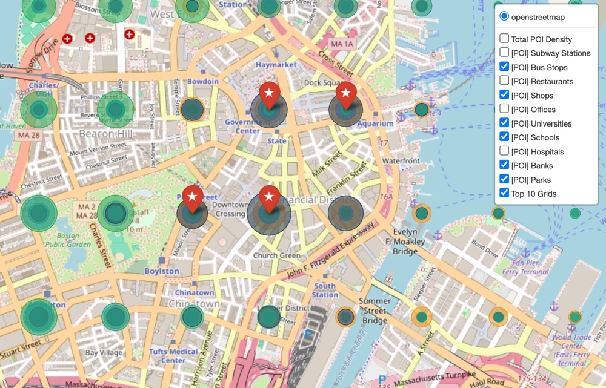
</p>

Interactive map: [`results/grid_analysis/grid_poi_map.html`](results/grid_analysis/grid_poi_map.html)

**Map Features:**
- **Total Grids**: 1,892 cells covering the Boston metro area
- **Grids with POI Data**: 1,723 cells (91% coverage)
- **Selectable Layers**: Users can toggle between 11 different layers:
  - Total POI Density (aggregate view)
  - Individual POI categories: Subway Stations, Bus Stops, Restaurants, Shops, Offices, Universities, Schools, Hospitals, Banks, Parks
  - Top 10 Grids (highlighted with star markers)
- **Visual Encoding**: Circle size represents the count (for countable POIs like restaurants) or area (for parks). Larger circles indicate higher POI density.
- **Interactivity**: Click any circle to view detailed POI counts for that grid cell.

This visualization allows exploration of which areas have high commercial activity, transit access, or educational institutions—all factors that the model identified as important demand predictors.

#### Visualization 2: Demand Prediction Map

I then applied the trained POI model to predict demand for all 1,892 grid cells and created a comparison map showing predicted demand versus actual station performance.

<p align="center">
  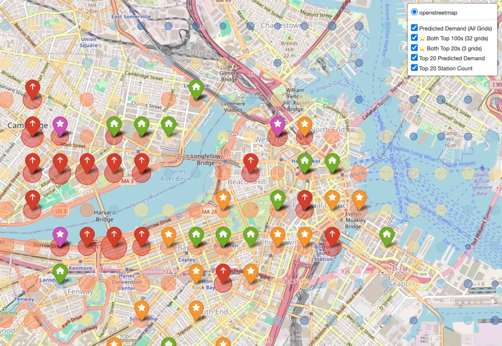
</p>

Interactive map: [`results/grid_analysis/grid_demand_map.html`](results/grid_analysis/grid_demand_map.html)

**Map Features:**
- **Reference Date**: July 15, 2024 (Monday, Summer peak)
- **Grids with Existing Stations**: 367 cells (for validation)
- **Predicted Demand Color Scale**:
  - Very High (>60 departures/day): Red
  - High (40-60): Orange
  - Medium (25-40): Yellow
  - Low (15-25): Light Blue
  - Very Low (<15): Dark Blue
- **Comparison Markers**:
  - Purple stars (★): Cells in both Top 20 predicted AND Top 20 actual (3 cells) - model accurately identifies top performers
  - Orange stars (★): Cells in both Top 100 predicted AND Top 100 actual (32 cells) - broad validation
  - Red arrows (↑): Top 20 predicted only - potential underserved high-demand locations
  - Green houses (⌂): Top 20 actual only - high-performing stations the model underestimated
- **Visual Encoding**: Circle size represents demand magnitude (larger = higher demand)
- **Layer Toggle**: Users can switch between predicted demand layer and actual station layer in the top-right corner

This map enables direct comparison between where the model predicts high demand and where stations actually perform well, validating model accuracy and identifying expansion opportunities.

#### Expansion Opportunities

Based on the grid analysis, I identified cells with high predicted demand but no existing stations. These represent potential locations for new stations.

**Output File**: [`results/grid_analysis/expansion_opportunities.csv`](results/grid_analysis/expansion_opportunities.csv)

**File Contents:**
- **Total Records**: 334 underserved grid cells
- **Columns**: grid_id, center_lat, center_lon, predicted_demand, actual_demand (0 for cells without stations), station_count (0), and all 10 POI feature counts

**Top 5 Expansion Candidates by Predicted Demand:**

| Rank | Grid ID | Location (lat, lon) | Predicted Demand | Key POI Features |
|------|---------|---------------------|------------------|------------------|
| 1 | 1298 | (42.360, -71.090) | 70.88 | 1 subway, 12 bus stops, 24 restaurants, 25 offices |
| 2 | 1209 | (42.351, -71.094) | 66.36 | 2 subway, 12 bus stops, 34 restaurants, 2 universities |
| 3 | 1250 | (42.355, -71.108) | 59.21 | 8 bus stops, 7 restaurants, 2 universities |
| 4 | 1165 | (42.346, -71.094) | 56.50 | 2 subway, 19 bus stops, 59 restaurants, 2 universities |
| 5 | 1259 | (42.355, -71.067) | 55.34 | 4 subway, 20 bus stops, 102 restaurants, 39 offices |

The full grid prediction results are available in `results/grid_analysis/grid_demand_comparison.csv`, containing all 1,892 cells with predicted demand, actual demand (where stations exist), and POI features.

#### Significance of Grid Analysis

The grid-based analysis demonstrates the practical value of the Phase 2 POI model for network expansion planning:

1. **Actionable Site Selection**: Unlike the Phase 1 model which requires historical data, the POI model can predict demand at any arbitrary location. The 334 identified expansion opportunities represent specific, data-driven recommendations for new station placement.

2. **Validation through Comparison**: The demand comparison map shows that 32 cells appear in both the Top 100 predicted and Top 100 actual lists, and 3 cells appear in both Top 20 lists. This overlap validates that the model's predictions correlate with real-world station performance.

3. **Investment Prioritization**: The ranked list in `expansion_opportunities.csv` allows Bluebikes to prioritize expansion investments based on predicted demand, focusing resources on locations most likely to generate high ridership.

---

## Summary

This project predicts bike-share demand for Boston's Bluebikes system using machine learning to support network expansion and capacity planning decisions.

### Data Collection

I collected and processed 10 years of Bluebikes trip data (2015-2024) covering approximately 28.6 million trips. The dataset was enriched with:
- **Temporal features**: month, day of week, season, holiday indicators
- **Weather data**: temperature, precipitation, wind speed from Open-Meteo API
- **Location features**: station coordinates and historical popularity metrics
- **POI features**: counts of restaurants, offices, transit stops, universities, schools, hospitals, banks, and park areas within 500m radius, extracted from OpenStreetMap

### Phase 1: Location-Based Model for Capacity Planning

I trained an XGBoost model using coordinates (latitude, longitude) and historical popularity (nearby_avg_popularity) alongside temporal and weather features. The model achieved R² = 0.258 on 2024 test data. This model is suitable for identifying existing stations that need capacity expansion, as overestimation often indicates demand constrained by insufficient bikes or docks rather than prediction error.

### Phase 2: POI-Based Model for New Station Site Selection

I trained an XGBoost model using POI features (restaurants, offices, transit access, universities, etc.) alongside temporal and weather features, explicitly removing coordinates and historical popularity to avoid data leakage. The model achieved R² = 0.248, comparable to the location-based model. This model is suitable for predicting demand at arbitrary new locations, as POI features describe what makes a location attractive rather than encoding specific historical patterns. I applied this model to 1,892 grid cells covering the Boston metro area and identified specific underserved high-demand locations for potential expansion.

The complete analysis pipeline, trained models, and interactive visualizations are available in this repository.

