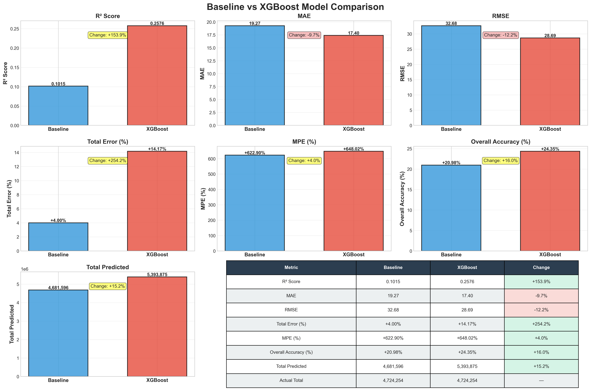

# BlueBike

## 1. Project Description & Motivation

The Bluebikes program, Boston's official bike-share system, makes its complete ridership data publicly available. This rich dataset provides details for every trip, including:

- Trip Duration (in seconds)
- Start and Stop Times
- Start and End Station Names & IDs
- Bike ID
- User Type (Casual vs. Member)

This data allows for a deep exploration of user ridership patterns and behaviors. The primary objective of this project is to leverage this dataset to uncover actionable insights into how, when, and where the service is used. Understanding these habits is the first step toward building predictive models that can help optimize the system's operational efficiency.

## 2. Project Objectives

The ultimate goal of this project is to provide data-driven recommendations that could help Bluebikes optimize its operational efficiency and improve bike availability for its users. To achieve this, I have defined the following core objectives:

- **Develop a Predictive Demand Model**: My primary technical objective is to build and validate a machine learning model that forecasts hourly bike demand. The model will predict the number of bike departures from any given station based on a range of features, including:
  - Station characteristics (e.g., location)
  - Temporal factors (time of day, day of week, holidays)
  - External conditions (historical weather data)

- **Generate a City-Wide Demand Heatmap for Strategic Network Planning**: Beyond forecasting for existing stations, the second aim is to formulate a spatial prediction model to estimate potential bike demand across the Boston/Cambridge area as a whole. This would be then used to locate strategically appropriate sites for the expansion and/or consolidation of the network.
  - **Prediction Target**: The potential number of bike departures within a given hour from a particular geographical grid cell—for instance, a 100m x 100m cell.
  - **Feature Engineering**: For the purpose of predicting demand at locations without previously existing stations, a rich geospatial feature set will be constructed at the level of the grid cell, which might include(not fixed):
    - The proximity to public transit interchange points, e.g., subway and bus stops
    - Density of points of interest, e.g., restaurants, offices, and parks
    - Local demographic features, e.g., population density
    - Local bike network characteristic features, e.g., the presence of protected bike lanes
  - **Expected Outcome**: The model output will be a complete city demand heatmap, highlighting untapped "hotspots" (potentially ideal locations for new stations) and demand "coldspots" (where existing stations may be underutilized and could be considered for relocation or removal).

- **Propose Novel Operational Strategies** (if time permitted): As a secondary objective, I will explore how the model could inform new strategies, such as implementing dynamic pricing during off-peak hours or offering user incentives to help redistribute bikes from over-supplied to under-supplied stations.

## 3. Data Collection Strategy

This project will utilize three primary data sources: Bluebikes' official ridership data, historical weather data, and various geospatial datasets describing the Boston area.

### Bluebikes Ridership Data

- **Source**: The complete dataset of historical trip data will be sourced directly from the official Bluebikes website: https://bluebikes.com/system-data
- **Methodology**: I will download the monthly trip data files (in CSV format). This will form the core of my dataset for training and testing my predictive models

### Historical Weather Data

- **Source**: Hourly historical weather data will be obtained via the Open-Meteo Historical Weather API, a reliable and publicly accessible source: https://open-meteo.com/en/docs/historical-weather-api
- **Methodology**: I will implement a Python script to programmatically collect the weather data. The process will be as follows:
  - Extract the latitude and longitude coordinates for every Bluebikes station from the ridership data
  - For my specified date range, the script will make API calls to request the corresponding hourly weather variables (including temperature, precipitation, and wind speed) for each station's location
  - The API responses will be parsed, cleaned, and structured into a tabular format ready to be merged with the Bluebikes trip data

### Geospatial & Demographic Data for Spatial Modeling

#### Public Transit Network

- **Source**: Official GTFS data for the MBTA network. The most up-to-date files are now version-controlled and can be found on the MBTA's official GitHub-style archive: https://cdn.mbta.com/archive/archived_feeds.txt
- **Methodology**: I will parse these files to extract the precise latitude and longitude of all subway and bus stops, which are critical drivers of bike trips.

#### Urban Infrastructure & Points-of-Interest (POIs)

- **Source**: This kind of data can be accessed via the OSMnx library: https://osmnx.readthedocs.io/en/stable/
- **Methodology**: I will use the Python library OSMnx to programmatically get data on the locations of key POIs (e.g., restaurants, offices, universities, parks).

#### Demographic Data

- **Source**: The U.S. Census Bureau's public data portal: https://data.census.gov/
- **Methodology**: I will acquire population density and potentially other demographic data at the census tract level. This will allow me to correlate potential bike demand with the characteristics of the people living and working in each area.

## 4. Modeling Approach

Since precise prediction of bike departures is challenging, my approach is to conduct a comparative study. I will implement several types of models to establish performance benchmarks and identify the most suitable method for this problem.

- **Baseline Model**: I will first establish a simple, non-machine learning baseline. This model will use straightforward rules to make predictions, serving as a critical benchmark to measure the effectiveness of my more advanced models

- **Tree-Based Models**: The ridership data is highly structured, making tree-based models an excellent candidate. I will explore ensemble methods like Gradient Boosting (e.g., XGBoost), which are known to perform very well on this type of tabular data.

  To effectively use these models, I will reframe the problem from a time-series task to a standard regression/classification task. This involves extensive feature engineering to explicitly extract key information—such as the hour of day, holiday status, station location, and weather conditions—from the raw data.

- **Deep Learning Models**: To explore alternative patterns in the data, especially potential time-series dependencies, I will also implement a deep learning model. This will provide a valuable point of comparison against the performance of the tree-based models

- **Exploratory LLM Integration** (If time permitted): As an extension, I will explore the capabilities of a Large Language Model (LLM). I plan to test its utility in two ways: first, as a tool for advanced feature engineering by interpreting the context of a situation, and second, by evaluating its ability to make direct predictions through prompting

## 5. Data Visualization Plan

My visualization strategy will focus on two key areas: exploratory data analysis to understand the data's underlying patterns and results visualization to interpret my model's performance. I will primarily use Python libraries such as Matplotlib, Seaborn, and Folium.

- **Geospatial Visualization**: I will create interactive maps of the Boston area to visualize station locations and ridership flow. A key visualization will be a heatmap of trip start and end points to quickly identify the most popular hubs and travel corridors in the city

- **Temporal Pattern Visualization**: To understand how demand changes over time, I will create:
  - Time-series plots showing daily and weekly trip counts to identify long-term trends and seasonality
  - Bar charts aggregating trips by the hour of the day and day of the week to reveal daily commute patterns and weekend activity

- **Correlation Visualization**: I will use scatter plots to investigate the relationship between weather conditions (like temperature and precipitation) and the number of bike trips, helping me validate key features for my model

- **Model Performance Visualization**: To evaluate my final model, I will plot the predicted demand values against the actual values over time. This will allow me to visually inspect where my model performs well and where it struggles

## 6. Test Plan

Because I am working with time-series data, I will not use a random split. I will perform a temporal split, using historical data for training and a more recent, unseen period for testing. For example, I might train my model on data from 2023-2024 and test its performance on data from 2025.

---

# Midterm Report

**Project Presentation Video**: [Link to be added]

## 1. Data Visualization

I created several visualizations to understand the Bluebikes data better. Here's what I found:

### System Growth Over Time

The system grew from about 1.1 million trips in 2015 to 4.7 million trips in 2024, with the number of stations increasing from around 100 to over 400. I excluded 2020 data from model training due to COVID-19 impacts.

### Daily Patterns

I noticed clear patterns in when people use the bikes:
- **Weekdays vs Weekends**: People use bikes differently on weekdays compared to weekends. Weekdays show typical commute patterns.
- **Monthly Changes**: Summer months (June-August) are way busier than winter months.

### Station Activity

Not all stations are equal. I found:
- The top 20 stations handle a huge portion of all trips
- Most stations are "medium activity" - they're not super busy but they're not empty either
- The network keeps growing - new stations get added almost every year

## 2. Data Processing

Here's what I did:

### Data Collection
I downloaded all the monthly trip files from the Bluebikes website (2015-2024). That's about 28.6 million trips total. Each trip record tells us when and where someone picked up a bike and where they dropped it off.

### Data Cleaning
The raw data had some issues:
- **Different column names**: Older files used different names than newer ones. For example, "subscriber" vs "member". I standardized everything.
- **Missing data**: Some early files didn't have trip duration, so I calculated it from start time and end time.
- **Station ID problems**: Station IDs changed from numbers to letters+numbers over the years. I decided to use station names instead since those are more consistent.
- **Outliers**: Some trips have unrealistic durations (under 10 seconds or over several days), but I kept all records in the dataset.

### Feature Engineering
I added a bunch of useful information to each trip:
- **Time features**: What month? What day of week? Is it a weekend? What season?
- **Holiday flag**: Is this date a US federal holiday?
- **Location features**: For each station, I calculated how busy the surrounding area is based on historical data

### Weather Data
I used the Open-Meteo API to get daily weather for each station. The challenge was:
- I needed weather for 800+ stations
- I needed 10 years of data (2015-2024)
- The API has rate limits (about 10 requests per minute)

So I built a system that caches the data as it downloads, which means if it gets interrupted, I can pick up where I left off instead of starting over. It took about 7 hours to get all the weather data.

The weather data includes: temperature (max/min/mean), precipitation, rain, snow, and wind speed.

### Data Aggregation
Since I'm predicting daily demand, I grouped all the trips by station and date. The final dataset has:
- **1.14 million records** (one for each station-date combination)
- **18 features** total
- **Target variable**: number of departures per station per day

## 3. Modeling Methods

I built two models to compare:

### Baseline Model
This is a simple model that assumes patterns repeat. Here's how it works:
1. Look at all the historical data (2015-2023, skipping 2020)
2. For each station, calculate what percentage of total trips it usually gets on day X of the year
3. Estimate what 2024's total trips will be using average growth rate from previous years
4. Multiply: station's historical percentage × estimated 2024 total = prediction

This model is simple but gives us something to beat.

### XGBoost Model
I use XGBoost as my first machine learning model for prediction. It uses gradient boosting, which is basically a bunch of decision trees working together.

**Features I used**:
- Time: month, day, day of week, season, weekend flag, holiday flag
- Location: latitude, longitude, plus how busy the surrounding area usually is
- Weather: 9 weather variables (temperature, precipitation, wind)

**Feature selection note**:
When I included "year" as a feature, the model predicted total 2024 volume far higher than the actual value. This is probably because the model learned a simple linear trend rather than understanding the actual patterns. So I removed the "year" feature and also excluded "previous month's total trips" to avoid mixing seasonal patterns with growth trends. I also used strong regularization (L1 and L2) to prevent overfitting.

**Training setup**:
- Training data: 2015-2023 (excluding 2020) = about 680K records
- Test data: 2024 = about 205K records
- I used 500 trees with a max depth of 5

## 4. Results

### Feature Importance

The most important features for prediction are:
1. **Nearby area activity** (22.1%) - Historical activity level of surrounding stations
2. **Temperature max** (13.0%) - Daily maximum temperature
3. **Latitude** (10.4%) - Station location (north-south)
4. **Longitude** (9.1%) - Station location (east-west)
5. **Temperature mean** (8.6%) - Daily average temperature
6. **Season** (6.6%) - Time of year
7. **Precipitation hours** (6.3%) - Duration of rain/snow

Location and weather are the primary drivers of bike demand, with the surrounding area's historical popularity being the single most important factor.

### Model Comparison

| Metric | Baseline | XGBoost | Improvement |
|--------|----------|---------|-------------|
| R² Score | 0.101 | 0.258 | +154% |
| MAE | 19.27 | 17.40 | -9.7% |
| RMSE | 32.68 | 28.69 | -12.2% |
| Total Error | +4.00% | +14.17% | Worse |

**R² Score**: This metric measures how much variance in the data the model can explain. XGBoost improved from 0.101 to 0.258, a 154% increase, indicating the model captures more than twice as many patterns in bike demand.

**MAE (Mean Absolute Error)**: This shows the average prediction error per station per day. XGBoost reduced the error from 19.27 to 17.40 bikes, a 9.7% improvement, meaning predictions are closer to actual values on average.

**RMSE (Root Mean Squared Error)**: This metric penalizes larger errors more heavily than MAE. XGBoost reduced RMSE from 32.68 to 28.69, a 12.2% improvement, showing the model made fewer extreme errors.

**Total Error Issue**: However, the model overestimates total 2024 volume by 14%, which is higher than Baseline's 4%. This suggests the model is somewhat too optimistic in its predictions. This could be because the model predicts higher demand on certain weather conditions that didn't occur as frequently. Possible improvements include adding a calibration step to adjust the total predictions, or using ensemble methods to balance optimistic and conservative predictions. On the positive side, this overestimation might indicate locations where more bikes could potentially be used if capacity were increased.

## Current Status

I have completed data collection, cleaning, and visualization for the Bluebikes dataset. I built and compared two prediction models: a simple baseline model and an XGBoost machine learning model. The XGBoost model shows clear improvements with R² increasing from 0.101 to 0.258, demonstrating that machine learning can capture patterns that simple historical methods miss.

**Code Organization**: All code is available in the GitHub repo:
- `src/data_collection/` - Data download scripts
- `src/preprocessing/` - Data cleaning and feature engineering
- `src/models/` - Baseline and XGBoost models
- `src/visualization/` - Visualization scripts
- `results/` - Figures and metrics
- `data/` - Raw and processed data (not uploaded due to size, excluded via .gitignore)

